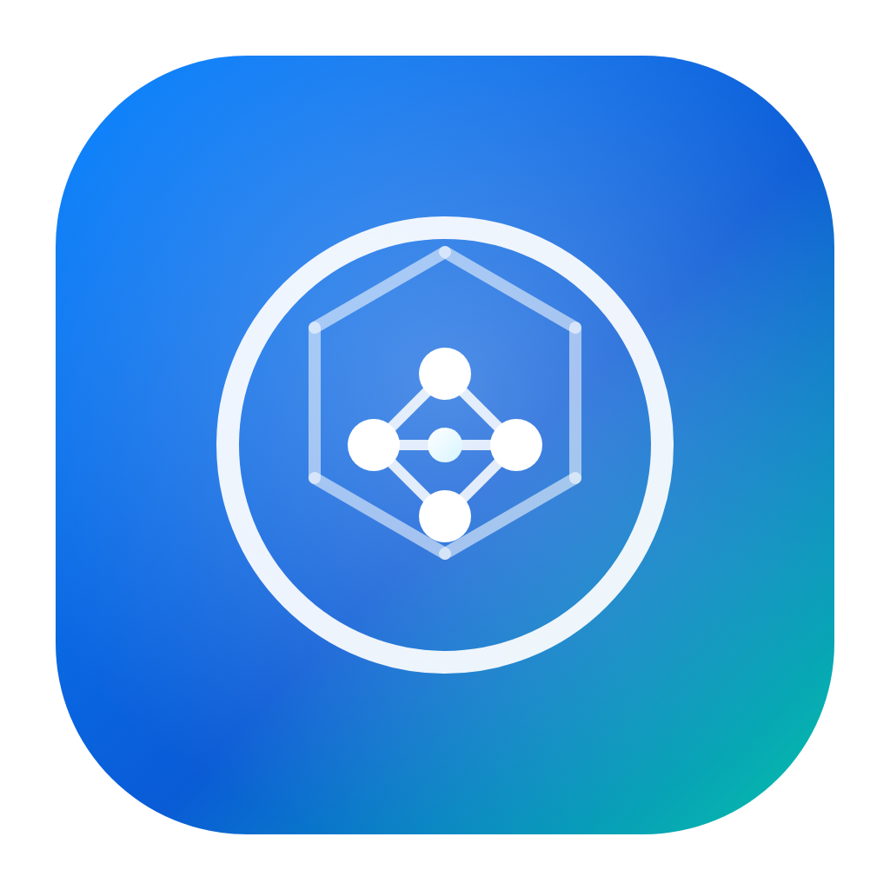
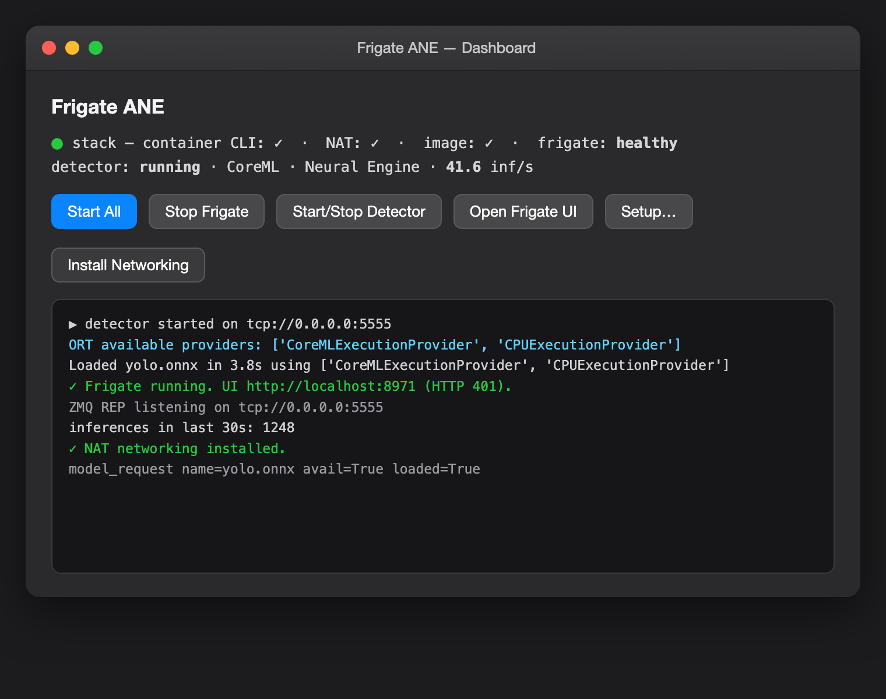

<p align="center"></p>

# Frigate ANE Detector (macOS, Apple Silicon)


> Run [Frigate](https://frigate.video) object detection on Apple's Neural Engine —
> with a one-window setup + dashboard for the whole stack.

A native macOS app that runs [Frigate](https://frigate.video) object detection on
the **Apple Neural Engine (ANE)** and gives you a one-window setup + dashboard for
the whole stack — MQTT / Home Assistant, recordings storage, cameras, and models.

<p align="center">
  
</p>
<p align="center"><sub>Dashboard — stack status, ANE detector throughput, and live logs.</sub></p>

## Why

Frigate's stock detectors don't use Apple's Neural Engine. This project runs YOLO
via ONNX Runtime's **CoreML execution provider** (`CPUAndNeuralEngine`) in a small
Python ZMQ server, and ships a native Swift app that supervises it and orchestrates
Frigate (running in Apple's `container` runtime).

## Architecture

```
┌──────────────────────────────┐        ZMQ tcp:5555        ┌────────────────────┐
│  FrigateANEDetector.app       │ ◀───────────────────────▶ │  Frigate container │
│  (native Swift, arm64)        │                            │  (Apple container) │
│  • Setup wizard               │   writes config.yaml ────▶ │  cameras, record,  │
│  • Dashboard / menubar        │   + start script           │  go2rtc, MQTT      │
│  • Supervises Python engine   │                            └────────────────────┘
│        │                      │
│        ▼                      │
│  engine/ (bundled python)     │
│   detector/zmq_onnx_client.py │  ── YOLO ONNX on the ANE (CoreML EP)
│   models/yolo.onnx            │
└──────────────────────────────┘
```

## Requirements

- Apple Silicon Mac (M1 or newer) — the ANE path requires arm64.
- macOS 13+ to run the app; **macOS 26 + Apple `container`** to run Frigate itself.
- Xcode command-line tools (for building from source).
- An MQTT broker (e.g. Home Assistant's Mosquitto) if you want HA integration.

## Build

```bash
git clone <your-fork-url> frigate-ane-mac
cd frigate-ane-mac
bash scripts/build.sh           # provisions engine, compiles, assembles the .app
open ~/Applications/FrigateANEDetector.app
```

`scripts/provision_engine.sh` downloads a relocatable Python (python-build-standalone),
installs `onnxruntime` / `pyzmq` / `numpy` into it, and exports a `yolo.onnx` (via
ultralytics) if one isn't present — so the bundled engine runs on any Apple-Silicon Mac.

## Use

1. Launch the app — the **Setup** wizard opens on first run.
2. Fill in the tabs:
   - **MQTT** — broker host/port/user/password.
   - **Home Assistant** — toggle MQTT auto-discovery.
   - **Storage** — pick a *mounted* drive/folder for recordings (the app warns if it's missing).
   - **Cameras** — add RTSP main/sub streams; set retention (continuous / event days).
   - **Models** — choose the YOLO `.onnx` (runs on the ANE); optionally enable a local
     AI vision model via Ollama for scene descriptions.
3. **Save & Generate Config** writes `config.yaml` + a guarded `start-frigate.sh` to
   `~/Library/Application Support/FrigateANE/`.
4. On the **Dashboard**, **Start All** ensures the container system is up, pulls the
   Frigate image if needed, and starts Frigate + the ANE detector. Open the Frigate
   UI at `http://localhost:8971`.

Settings live in `~/Library/Application Support/FrigateANE/config.json`. No secrets
are committed to the repo.

## Networking (container ↔ LAN)

Frigate runs inside Apple's `container` VM on subnet `192.168.64.0/24`. To reach LAN
cameras / MQTT / Ollama it needs NAT. The app ships a one-click **Install Networking**
action (Dashboard) that installs a `pf` ruleset + a `com.frigateane.nat` LaunchDaemon
(templates in [`networking/`](networking/)) via a single admin prompt. Start-up also
runs a health check and waits for Frigate to report running.

## Features

- ANE object detection — YOLO via ONNX Runtime's CoreML execution provider.
- Setup wizard — MQTT, Home Assistant discovery, storage path, cameras + retention, models.
- Connection tests — MQTT CONNECT check, detector ANE self-test, per-camera RTSP reachability.
- Per-camera config — tracked objects, detect FPS/resolution, and advanced zones/YAML.
- Launch-at-login + auto-start Frigate/detector on launch.
- Dashboard live stats — inferences/sec sparkline, auto-refreshing stack status, menubar throughput.
- Portable bundled Python — relocatable interpreter, no Homebrew/system Python needed.
- One-click container NAT networking + container-runtime detection/install.

## Signing & notarization

To ship a build that opens without the right-click step, sign with a **Developer ID
Application** certificate and notarize:

```bash
# one-time: store notarytool credentials
xcrun notarytool store-credentials FrigateANE \
  --apple-id you@example.com --team-id TEAMID --password <app-specific-password>

SIGN_IDENTITY="Developer ID Application: Your Name (TEAMID)" \
NOTARY_PROFILE=FrigateANE \
bash scripts/notarize.sh
```

`scripts/notarize.sh` signs the app + bundled Python under the **hardened runtime**
(see `Resources/entitlements.plist`), builds a DMG, submits to Apple, and staples the
ticket. Requires an Apple Developer Program membership.

## Known limitations

- The app is ad-hoc signed, not notarized — first launch needs right-click → **Open**.
- Running Frigate itself requires macOS 26 + Apple `container` (the ANE detector works
  independently on macOS 13+).

## Contributing

Contributions are welcome — issues, feature ideas, and pull requests alike.

1. Fork the repo and create a branch: `git checkout -b my-feature`.
2. Build locally: `bash scripts/build.sh` (provisions the engine, compiles, assembles the `.app`).
3. Keep changes focused; match the existing Swift style (programmatic AppKit, no storyboards).
4. Open a PR describing the change and how you tested it.

See [CONTRIBUTING.md](CONTRIBUTING.md) for details.

## Acknowledgements

This project stands on excellent open-source work:

- **[Frigate](https://frigate.video)** by Blake Blackshear and contributors — the NVR this plugs into.
- **[ONNX Runtime](https://onnxruntime.ai)** and its **CoreML execution provider** — the bridge to the Apple Neural Engine.
- **[Apple `container`](https://github.com/apple/container)** — the native runtime that hosts Frigate on macOS.
- **[Ultralytics YOLO](https://github.com/ultralytics/ultralytics)** — the detection models.
- **[ZeroMQ](https://zeromq.org) / [pyzmq](https://github.com/zeromq/pyzmq)** — the detector IPC transport.
- **[Ollama](https://ollama.com)** — optional local AI scene descriptions.
- **[Home Assistant](https://www.home-assistant.io)** — MQTT discovery / smart-home integration.

## Thanks

Built by **[@naniguggilapu](https://github.com/naniguggilapu)**. Thanks to the Frigate
community for the detector-plugin protocol that made the Apple Neural Engine path possible.

## License

MIT — see [LICENSE](LICENSE). You're free to use, modify, and distribute this; a link
back is appreciated but not required.
