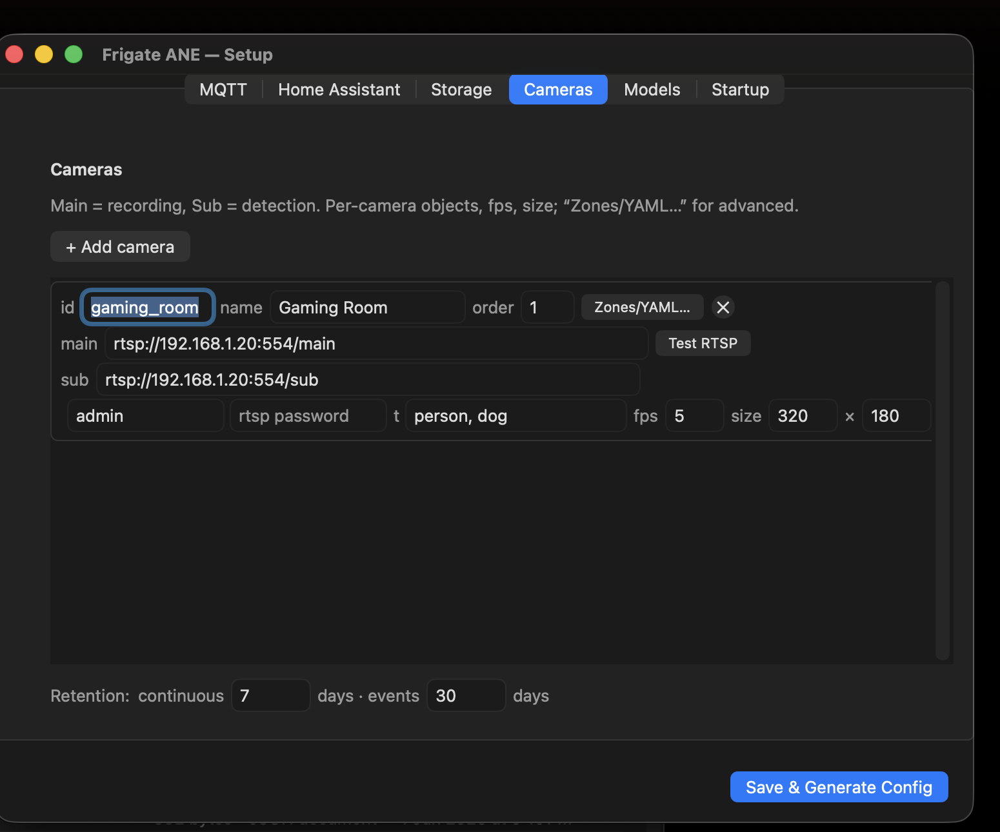
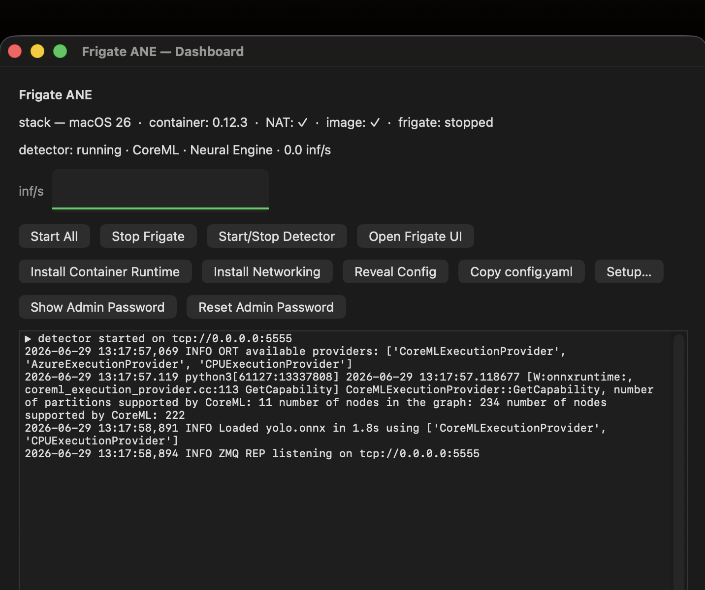

<p align="center"></p>

# Frigate ANE Detector (macOS, Apple Silicon)


> Run [Frigate](https://frigate.video) object detection on Apple's Neural Engine —
> with a one-window setup + dashboard for the whole stack.

A native macOS app that runs [Frigate](https://frigate.video) object detection on
the **Apple Neural Engine (ANE)** and gives you a one-window setup + dashboard for
the whole stack — MQTT / Home Assistant, recordings storage, cameras, and models.

<p align="center">
  
  &nbsp;&nbsp;
  
</p>
<p align="center"><sub>Left: the one-window setup wizard (cameras, with per-camera streams, login, objects, FPS). &nbsp; Right: the dashboard — stack status, the detector live on the Apple Neural Engine (CoreML), and one-click controls including admin-password show/reset.</sub></p>

## Why

Frigate's stock detectors don't use Apple's Neural Engine. The community already worked
out how to bridge them — running a YOLO ONNX model through ONNX Runtime's **CoreML
execution provider** in a small Python ZMQ server that Frigate (in Apple's `container`
runtime) talks to. That setup is powerful but entirely manual: shell scripts, `pf` NAT
rules, launchd plists, and hand-edited YAML.

**This project turns that manual setup into a native macOS app** — a one-click setup
wizard, dashboard, config generator, and orchestrator wrapped around the same
Apple-Silicon ZMQ detector approach. See [Credits](#credits) for the upstream work this
builds on.

## How this differs from `apple-silicon-detector`

The excellent [`frigate-nvr/apple-silicon-detector`](https://github.com/frigate-nvr/apple-silicon-detector)
already solves the hard part — running the model on the Neural Engine. **This is not a
detector and not a replacement for it.** Their app is a Terminal launcher for the
detector; it (correctly) leaves the rest of the Frigate setup to you. This project adds
the layer around it:

| | apple-silicon-detector | this app |
|---|---|---|
| Object detection on the ANE | ✅ (this is theirs) | uses their approach |
| Interface | opens a Terminal window | native GUI — wizard, dashboard, menubar |
| Python | you install it (3.11+) yourself | bundled — nothing to install |
| Frigate `config.yaml` | hand-written | generated by a wizard |
| Container / NAT / storage / MQTT setup | manual (a how-to gist) | one-click in-app |
| Start/stop & health-check Frigate | — | built in |
| Camera RTSP credentials | hand-edit into the URL | separate user/password fields, injected |
| Scrypted rebroadcast | look it up manually | detected, one-click open |
| Frigate admin password | dig through container logs | Show / Reset buttons |
| Backup / restore config | copy files around | one-click |

### Why it's needed

The detector works, but actually *getting Frigate running* on a Mac still means a
multi-step manual guide — Apple `container`, `pf` NAT rules, launchd services, and
hand-edited YAML. That's fine for developers and a wall for everyone else. This app
exists so a **non-developer can go from download to a running Frigate + ANE detector
without touching a terminal or a config file**.

## Architecture

```
┌──────────────────────────────┐        ZMQ tcp:5555        ┌────────────────────┐
│  FrigateANEDetector.app       │ ◀───────────────────────▶ │  Frigate container │
│  (native Swift, arm64)        │                            │  (Apple container) │
│  • Setup wizard               │   writes config.yaml ────▶ │  cameras, record,  │
│  • Dashboard / menubar        │   + start script           │  go2rtc, MQTT      │
│  • Supervises Python engine   │                            └────────────────────┘
│        │                      │
│        ▼                      │
│  engine/ (bundled python)     │
│   detector/zmq_onnx_client.py │  ── YOLO ONNX on the ANE (CoreML EP)
│   models/yolo.onnx            │
└──────────────────────────────┘
```

## Requirements

- Apple Silicon Mac (M1 or newer) — the ANE path requires arm64.
- macOS 13+ to run the app; **macOS 26 + Apple `container`** to run Frigate itself.
- Xcode command-line tools (for building from source).
- An MQTT broker (e.g. Home Assistant's Mosquitto) if you want HA integration.

## Build

```bash
git clone <your-fork-url> frigate-ane-mac
cd frigate-ane-mac
bash scripts/build.sh           # provisions engine, compiles, assembles the .app
open ~/Applications/FrigateANEDetector.app
```

`scripts/provision_engine.sh` downloads a relocatable Python (python-build-standalone),
installs `onnxruntime` / `pyzmq` / `numpy` into it, and exports a `yolo.onnx` (via
ultralytics) if one isn't present — so the bundled engine runs on any Apple-Silicon Mac.

## Use

1. Launch the app — the **Setup** wizard opens on first run.
2. Fill in the tabs:
   - **MQTT** — broker host/port/user/password.
   - **Home Assistant** — toggle MQTT auto-discovery.
   - **Storage** — pick a *mounted* drive/folder for recordings (the app warns if it's missing).
   - **Cameras** — give each camera a unique **id** + optional display name, paste the
     RTSP **main** (record) / **sub** (detect) streams, optional RTSP **user/password**
     (injected for you), tracked objects, FPS, and UI order. *Zones/YAML…* for advanced.
     Using **Scrypted**? Click **Detect Scrypted** → **Open** and copy each camera's
     rebroadcast RTSP URL (no login needed).
   - **Models** — choose the YOLO `.onnx` (runs on the ANE); optionally enable a local
     AI vision model via Ollama for scene descriptions.
3. **Save & Generate Config** writes `config.yaml` + a guarded `start-frigate.sh` to
   `~/Library/Application Support/FrigateANE/`.
4. On the **Dashboard**, **Start All** ensures the container system + kernel are up,
   pulls the Frigate image if needed, and starts Frigate + the ANE detector. Then
   **Open Frigate UI** → `https://localhost:8971` (it's HTTPS with a self-signed cert,
   so accept the warning the first time).
5. Frigate creates an **admin** user with a random password on first start. Click
   **Show Admin Password** to read it from the logs, or **Reset Admin Password** to
   generate a new one.

Settings live in `~/Library/Application Support/FrigateANE/config.json`. No secrets
are committed to the repo.

## Networking (container ↔ LAN)

Frigate runs inside Apple's `container` VM on subnet `192.168.64.0/24`. To reach LAN
cameras / MQTT / Ollama it needs NAT. The app ships a one-click **Install Networking**
action (Dashboard) that installs a `pf` ruleset + a `com.frigateane.nat` LaunchDaemon
(templates in [`networking/`](networking/)) via a single admin prompt. Start-up also
runs a health check and waits for Frigate to report running.

## Features

**Setup wizard** (one window, no terminal)
- MQTT, Home Assistant discovery, and a recordings **storage** picker (warns if the drive isn't mounted).
- **Cameras** — unique id + display alias, RTSP **main/sub** streams, RTSP **user/password**
  (injected for you), tracked objects, detect FPS/resolution, UI order, and per-camera zones/YAML.
- **Models** — pick the YOLO `.onnx`, the Frigate **model type** (yolo-generic / yolonas / yolov9 /
  rfdetr / dfine) and input size; optional local AI (Ollama) for scene descriptions.
- **Scrypted detection** — find a Scrypted server and open it to copy each camera's **rebroadcast
  RTSP URL** (no camera credentials needed).
- **Connection tests** — MQTT CONNECT, per-camera RTSP reachability, and an ANE detector self-test.

**Orchestration & dashboard**
- One-click **Start All** — ensures the Apple `container` runtime + kernel, pulls the Frigate image,
  installs `pf` NAT networking, generates `config.yaml`, and starts Frigate + the ANE detector.
- Container-runtime **auto-detect + guided install** (Apple's signed `container` `.pkg`).
- **Auto-detect container IP** for opening the Frigate UI + health checks (works even where
  `localhost` isn't forwarded).
- **Admin password** — show the one Frigate generates on first start, or reset it.
- **Backup / Restore** config to a JSON file.
- Live stats — inferences/sec sparkline, auto-refreshing stack status, menubar throughput.

**Detector**
- YOLO via ONNX Runtime's **CoreML execution provider** on the Apple Neural Engine.
- **Portable bundled Python** (python-build-standalone) — runs on any Apple-Silicon Mac, nothing to install.

**Launch-at-login + auto-start** Frigate/detector on boot.

## Signing & notarization

To ship a build that opens without the right-click step, sign with a **Developer ID
Application** certificate and notarize:

```bash
# one-time: store notarytool credentials
xcrun notarytool store-credentials FrigateANE \
  --apple-id you@example.com --team-id TEAMID --password <app-specific-password>

SIGN_IDENTITY="Developer ID Application: Your Name (TEAMID)" \
NOTARY_PROFILE=FrigateANE \
bash scripts/notarize.sh
```

`scripts/notarize.sh` signs the app + bundled Python under the **hardened runtime**
(see `Resources/entitlements.plist`), builds a DMG, submits to Apple, and staples the
ticket. Requires an Apple Developer Program membership.

## Known limitations

- The app is ad-hoc signed, not notarized — first launch needs right-click → **Open**.
- Running Frigate itself requires macOS 26 + Apple `container` (the ANE detector works
  independently on macOS 13+).

## Contributing

Contributions are welcome — issues, feature ideas, and pull requests alike.

1. Fork the repo and create a branch: `git checkout -b my-feature`.
2. Build locally: `bash scripts/build.sh` (provisions the engine, compiles, assembles the `.app`).
3. Keep changes focused; match the existing Swift style (programmatic AppKit, no storyboards).
4. Open a PR describing the change and how you tested it.

See [CONTRIBUTING.md](CONTRIBUTING.md) for details.

## Credits

This app builds directly on prior community work, both MIT-licensed:

- **[frigate-nvr/apple-silicon-detector](https://github.com/frigate-nvr/apple-silicon-detector)**
  — the Apple-Silicon ZMQ detector for Frigate. The bundled detector engine
  (`engine/detector/`) is derived from this project, which makes the Neural Engine path possible.
- **[harb70's "Frigate on Apple Container" how-to](https://gist.github.com/harb70/0ca2fa85b70b242575d8c050a2a66ada)**
  — the manual setup (container launch, `pf` NAT rules, launchd services, config layout)
  that this app automates. The networking templates and orchestration follow that guide.

This project's own contribution is the **native macOS app** around that approach: the
SwiftUI/AppKit setup wizard, dashboard, config generator, orchestrator, connection tests,
and portable-Python packaging.

## Acknowledgements

This project also stands on excellent open-source work:

- **[Frigate](https://frigate.video)** by Blake Blackshear and contributors — the NVR this plugs into.
- **[ONNX Runtime](https://onnxruntime.ai)** and its **CoreML execution provider** — the bridge to the Apple Neural Engine.
- **[Apple `container`](https://github.com/apple/container)** — the native runtime that hosts Frigate on macOS.
- **[Ultralytics YOLO](https://github.com/ultralytics/ultralytics)** — the detection models.
- **[ZeroMQ](https://zeromq.org) / [pyzmq](https://github.com/zeromq/pyzmq)** — the detector IPC transport.
- **[Ollama](https://ollama.com)** — optional local AI scene descriptions.
- **[Scrypted](https://www.scrypted.app)** — optional camera **rebroadcast** source (credential-free RTSP for Frigate).
- **[Home Assistant](https://www.home-assistant.io)** — MQTT discovery / smart-home integration.

## Thanks

Built by **[@naniguggilapu](https://github.com/naniguggilapu)**. Thanks to the Frigate
community for the detector-plugin protocol that made the Apple Neural Engine path possible.

## License

MIT — see [LICENSE](LICENSE). You're free to use, modify, and distribute this; a link
back is appreciated but not required.
